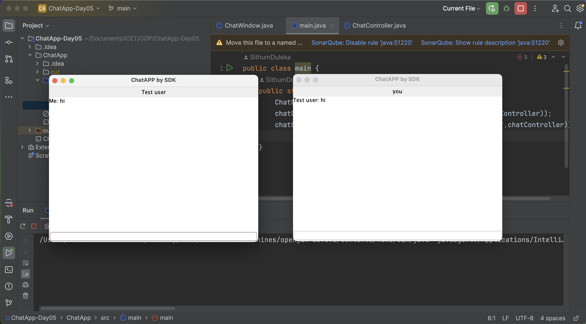

# JFrame Chat Application

A simple desktop chat application built using Java Swing's `JFrame`.  
This project demonstrates basic GUI development and client-server communication in Java.

---

## Features

- User-friendly chat interface using JFrame  
- Real-time messaging between multiple clients (if implemented)  
- Basic message sending and receiving functionality  
- Simple and clean UI layout with Swing components  

---

## Screenshot

---

## Prerequisites

- Java Development Kit (JDK) 8 or above installed  
- IDE (e.g., IntelliJ IDEA, Eclipse) or command line tools  
- Basic understanding of Java Swing and OOP concpets

---

